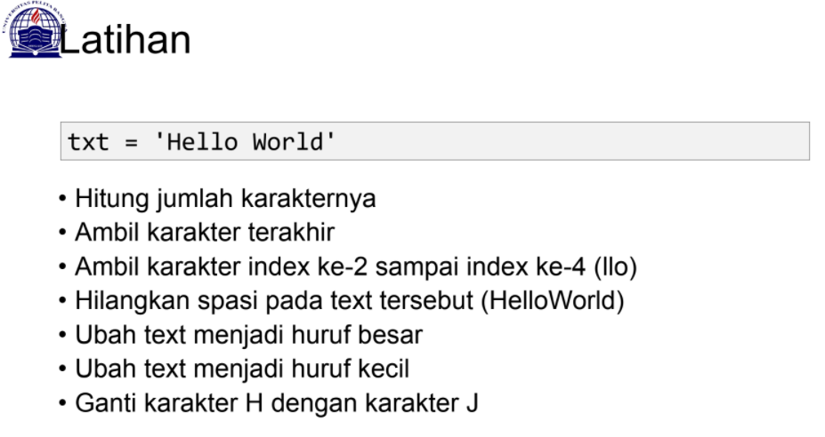
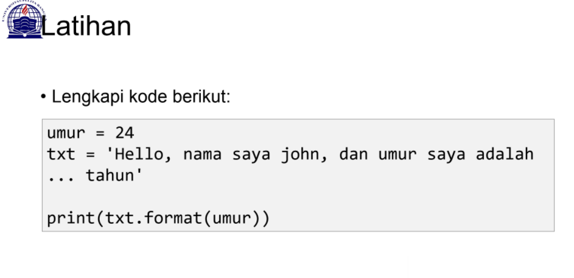
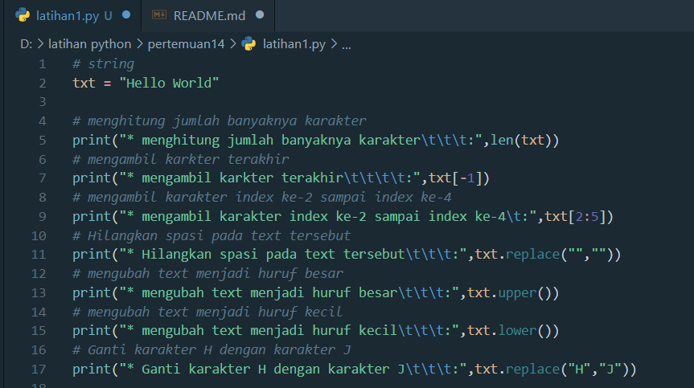
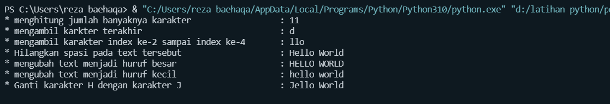
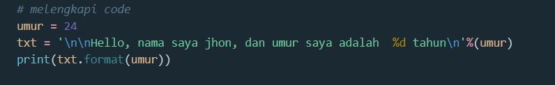
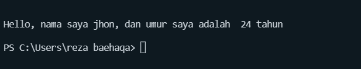

# pertemuan14
```sh
Nama    : A. Reza Baehaqa Jamroni
Nim     : 312110494
Matkul  : Bahasa Perograman
```
<p>
<p>
### latihan 1
• Hitung jumlah karakternya yaitu menggunakan method
```s
print(len('Hello Word'))
# mengambil karkter terakhir
```
• Ambil karakter terakhir
```s
txt[-1]
```
• Ambil karakter index ke-2 sampai index ke-4 (llo)
```s
txt[2:5]
```
• Hilangkan spasi pada text tersebut (HelloWorld)
```s
txt.replace("","")
```
• Ubah text menjadi huruf besar
```s
txt.upper()
```
• Ubah text menjadi huruf kecil
```s
txt.lower()
```
• Ganti karakter H dengan karakter J
```s
txt.replace("H","J")
```
### Tampilan Visual Studio Code
<p>
### Tampilan outputnya
<p>

### Latihan 2
### Tampilan Visual Studio Code
<p>

### Tampilan outputnya
<p>
